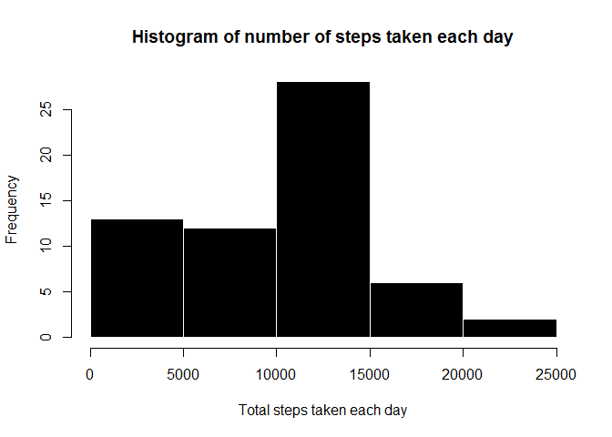
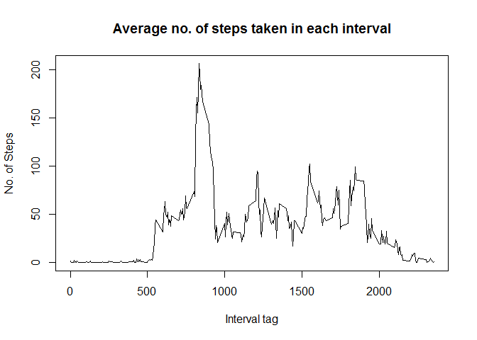
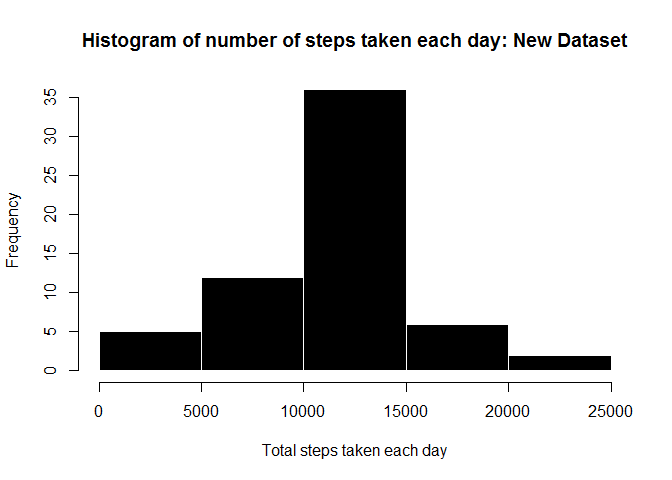

# Reproducible Research: Peer Assessment 1


## Loading and preprocessing the data


```r
activity <- read.csv("activity.csv")
library(dplyr)
```

## What is mean total number of steps taken per day?

Here is the histogram of the number of steps taken each day:


```r
que1 <- activity %>% group_by(date) %>% summarise(totalSteps = sum(steps,na.rm=TRUE))
hist(que1$totalSteps,
     main = "Histogram of number of steps taken each day",
     xlab = "Total steps taken each day",
     col = "black", border = "#FFFFFF")
```

<!-- -->

The mean of total number of steps taken per a day is:


```r
mean(que1$totalSteps)
```

```
## [1] 9354.23
```

The median of total number of steps taken per a day is:


```r
median(que1$totalSteps)
```

```
## [1] 10395
```

## What is the average daily activity pattern?

Here is the time series plot for average number of steps taken for each 5 min interval.


```r
que2 <- activity %>% group_by(interval) %>%
  summarise(avgSteps = mean(steps,na.rm=TRUE))
with(que2, plot(interval, avgSteps, type = "l",
                main = "Average no. of steps taken in each interval",
                xlab = "Interval tag",
                ylab = "No. of Steps"))
```

<!-- -->

The time interval which has the maximum number of average steps is:


```r
as.numeric(que2[que2$avgSteps == max(que2$avgSteps),][1])
```

```
## [1] 835
```

## Imputing missing values

The no. of rows in the table with missing values is:


```r
sum(is.na(activity$steps))
```

```
## [1] 2304
```

My strategy for filling missing values is to replace it with the average no. of steps in that interval, by using the values we already calculated in the above part.


```r
newSteps <- c()
for (i in 1:dim(activity)[1]) {
  if (is.na(activity$steps[i])) {
    newSteps <- cbind(newSteps,que2$avgSteps[que2$interval == activity$interval[i]])
  }
  else newSteps <- cbind(newSteps, activity$steps[i])
}
```

Creating new dataset, by using the new variable newSteps:


```r
newActivity <- activity %>% mutate(newsteps = as.vector(newSteps))
```

Here is the histogram of the number of steps taken each day:


```r
que3 <- newActivity %>% group_by(date) %>% summarise(totalSteps = sum(newsteps))
hist(que3$totalSteps,
     main = "Histogram of number of steps taken each day: New Dataset",
     xlab = "Total steps taken each day",
     col = "black", border = "#FFFFFF")
```

<!-- -->

The mean of total number of steps taken per a day is:


```r
mean(que3$totalSteps)
```

```
## [1] 10766.19
```

The median of total number of steps taken per a day is:


```r
median(que3$totalSteps)
```

```
## [1] 10766.19
```

We can see the effect of filling NA values here. Due to adding means of steps every time, the median got closer to the mean than the previous time. SInce there are many number of means in the central region, median and mean turned out to be one and the same thing. Also, adding a lot of means created a long vertical bar in the histogram too.

## Are there differences in activity patterns between weekdays and weekends?

Creating a new variable 'week':


```r
temp <- weekdays(as.Date(newActivity$date))
week <- ifelse(temp == "Saturday" | temp == "Sunday", "Weekend","Weekday")
```

Plotting the time series:


```r
library(lattice)
newActivity <- newActivity %>% mutate(Week = factor(week))
que4 <- newActivity %>% group_by(interval,Week) %>%
  summarise(avgSteps = mean(newsteps))
xyplot(avgSteps ~ interval| Week, 
           data = que4,
           type = "l",
           xlab = "Interval",
           ylab = "Number of Avg steps",
           layout=c(1,2))
```

<!-- -->

So we see that on weekends, people take steps in all time intervals, unlike the time in weekdays where people take steps only in some time intervals. We can't deduce anything without knowing the time intervals.
